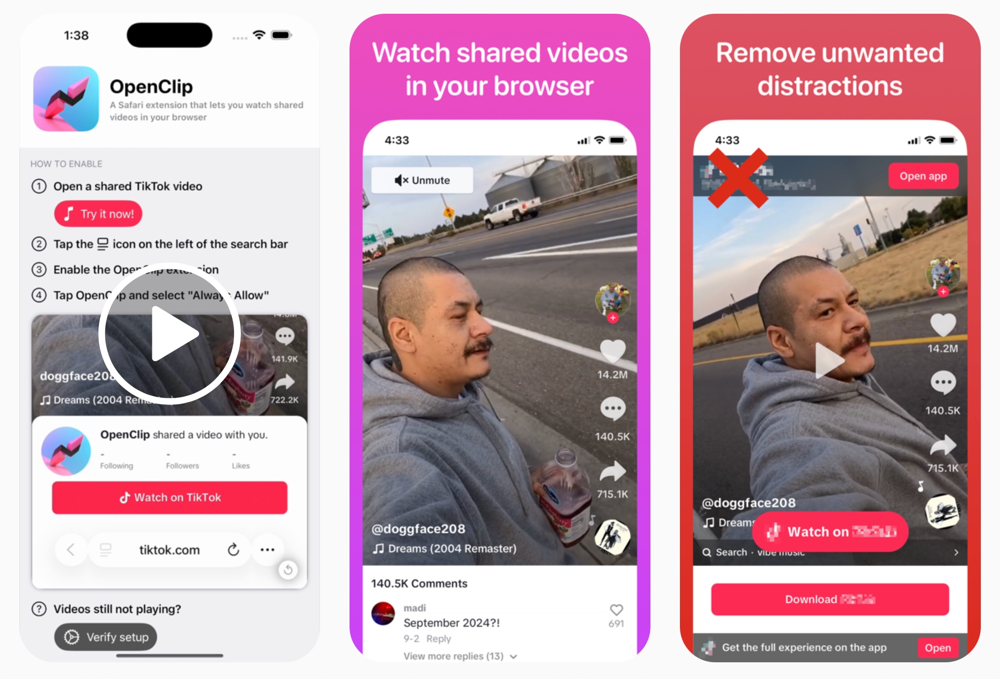

# OpenClip

OpenClip for Safari is a browser extension that lets you watch shared social videos in your browser.

By removing unnecessary tracking details from shared links, OpenClip helps you watch videos from friends and family without having to download social media apps or create accounts. The extension also cleans up video pages for a distraction-free viewing experience.

---

If you are curious to explore, the app itself is written in SwiftUI and serves as a guide on how to enable the extension. You can find the top level views defined in `OpenClip/ContentView.swift`.

The core _functionality_ of OpenClip for Safari is packaged within its extension. You can find the following in `OpenClip Extension/Resources/`:
- `content.js`: This performs the redirect that fixes the video links (using the solution found [here](https://www.reddit.com/r/Tiktokhelp/comments/1cxeaf6/comment/l5cmpow/?utm_source=share&utm_medium=web3x&utm_name=web3xcss&utm_term=1&utm_content=share_button)). It simply trims off the query parameters.
- `content.css`: This defines the styles that hide the banners and popups on the page. My goal was to get rid of any element that interfered with viewing or that redirected you to download the app.

Hope you enjoy!
